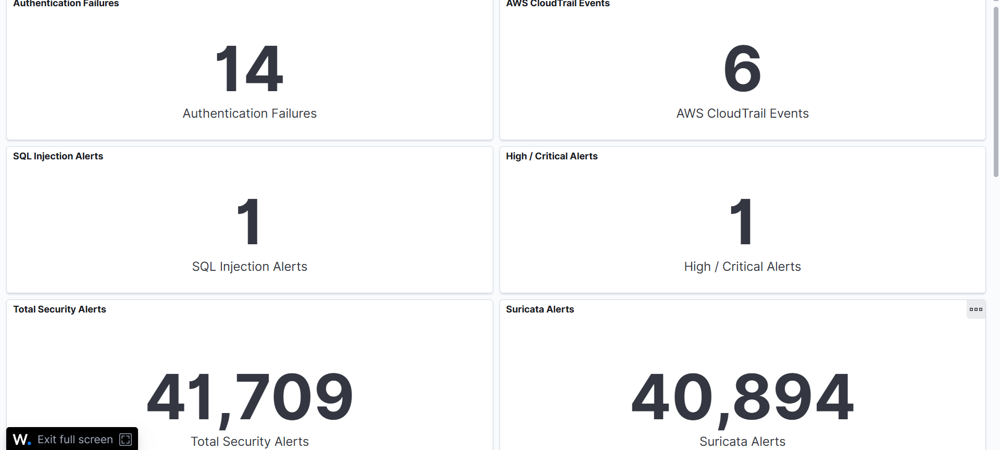
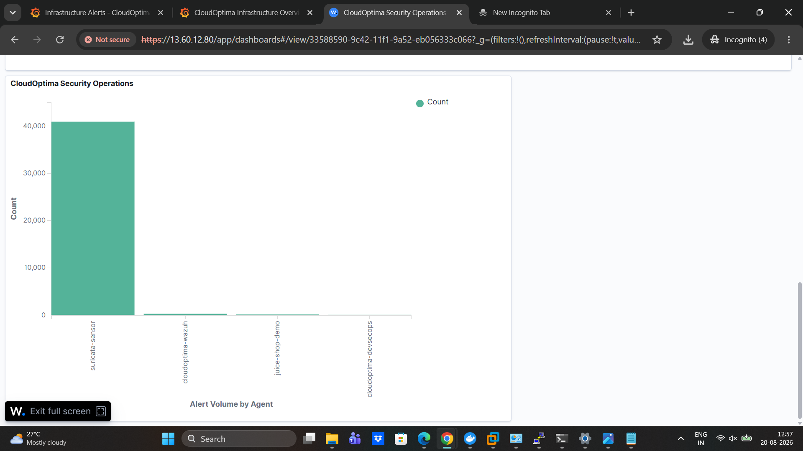
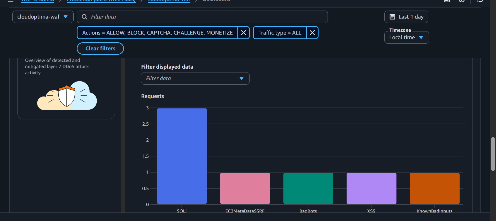
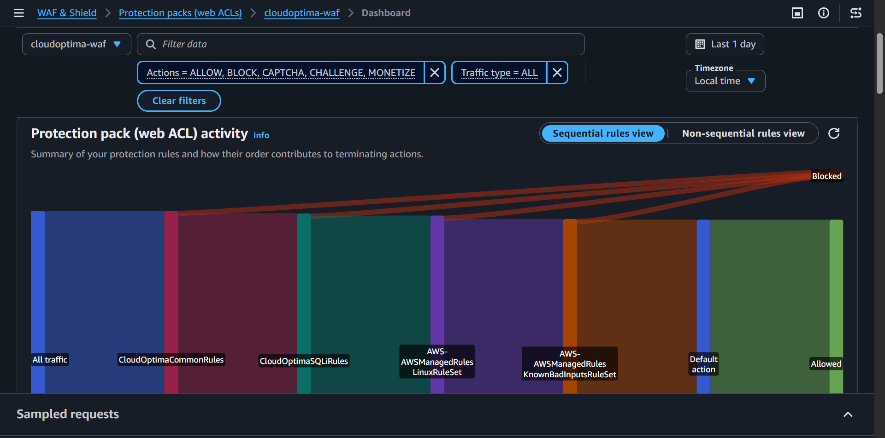
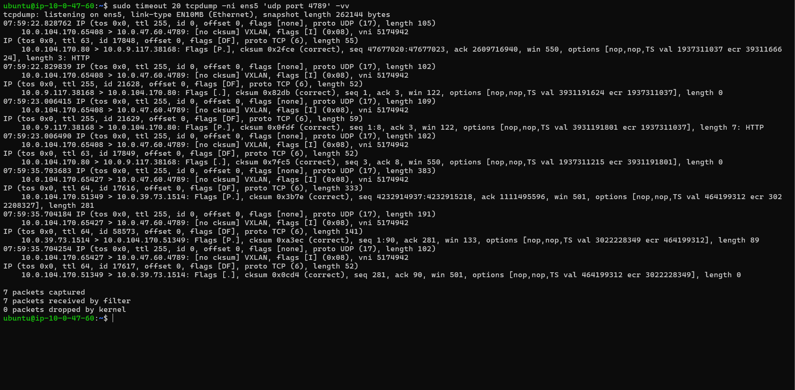
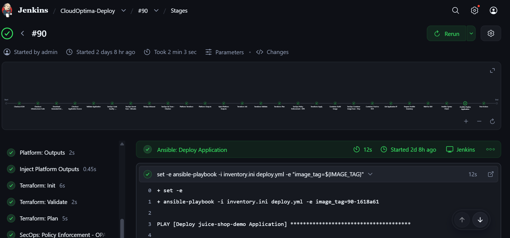

# ☁️ CloudOptima CloudOptima: A DevSecOps-Integrated Internal Developer Platform for Automated, Secure & Policy-Governed AWS Provisioning 🕵️

[](https://aws.amazon.com/)
[](https://www.jenkins.io/)
[](https://developer.hashicorp.com/terraform)
[](https://www.ansible.com/)
[](https://www.docker.com/)
[](https://wazuh.com/)
[](https://suricata.io/)
[](https://grafana.com/)

> CloudOptima is an AWS-based Internal Developer Platform and DevSecOps security environment that connects self-service provisioning, secure CI/CD, cloud protection, network detection, SIEM, audit logging, and observability.

---

## 🧭 Project at a Glance

CloudOptima was built as an end-to-end engineering platform rather than a collection of unrelated tools.

```text
Developer
   │
   ▼
CloudOptima IDP
   │
   ▼
GitHub
   │
   ▼
Jenkins
   │
   ├── SonarQube
   ├── GitLeaks
   ├── Terraform
   ├── Checkov
   ├── Infracost
   ├── OPA
   ├── Docker
   ├── Trivy
   ├── Amazon ECR
   └── Ansible
          │
          ▼
       AWS Runtime
          │
          ├── AWS WAF
          ├── ALB
          └── Juice Shop
                  │
          ┌───────┴────────┐
          │                │
          ▼                ▼
       Wazuh          Traffic Mirror
       Agent               │
                           ▼
                       Suricata IDS
                           │
                           ▼
                         Wazuh
                           │
                           ▼
                    Security Dashboard

AWS CloudTrail
      │
      ▼
      S3
      │
      ▼
    Wazuh

Prometheus + Loki
      │
      ▼
    Grafana
```

## 🏗️ Overall Architecture


---

## 🎯 Why CloudOptima?

CloudOptima connects the software-delivery lifecycle with runtime security:

```text
Request
  ↓
Generate
  ↓
Review
  ↓
Scan
  ↓
Build
  ↓
Deploy
  ↓
Protect
  ↓
Detect
  ↓
Investigate
  ↓
Observe
```

The project demonstrates practical engineering across:

- Platform Engineering
- DevOps
- DevSecOps
- AWS Cloud Security
- SOC / SIEM
- Network Security
- Infrastructure as Code
- Container Security
- Observability

---

## 🧰 Technology Stack

| Area | Technologies |
|---|---|
| IDP | Flask, PostgreSQL, Terraform Generator, Ansible Generator, GitHub Integration |
| Source Control | GitHub |
| CI/CD | Jenkins |
| IaC | Terraform |
| Configuration | Ansible |
| Code Quality | SonarQube |
| Secret Detection | GitLeaks |
| IaC Security | Checkov |
| Policy-as-Code | OPA |
| Cost | Infracost |
| Containers | Docker |
| Container Security | Trivy |
| Registry | Amazon ECR |
| Cloud | AWS EC2, ALB, WAF, IAM, S3, CloudTrail |
| Network Security | Suricata, AWS Traffic Mirroring |
| SIEM | Wazuh |
| Metrics | Prometheus, Node Exporter |
| Logs | Loki, Promtail |
| Visualization | Grafana |
| Attack Testing | Kali Linux |
| Target | OWASP Juice Shop |

---

## 🛡️ Security Validation

Five controlled web-attack scenarios were successfully validated against the CloudOptima ALB/WAF path.

| Attack | Security Control | Result |
|---|---|---|
| SQL Injection | `AWSManagedRulesSQLiRuleSet` | ✅ BLOCK |
| XSS | `AWSManagedRulesCommonRuleSet` | ✅ BLOCK |
| LFI / Path Traversal | `AWSManagedRulesLinuxRuleSet` | ✅ BLOCK |
| Log4Shell-style known-bad input | `AWSManagedRulesKnownBadInputsRuleSet` | ✅ BLOCK |
| SSRF / EC2 metadata access attempt | `AWSManagedRulesCommonRuleSet` | ✅ BLOCK |

Additional validated security events:

| Event | Detection |
|---|---|
| SSH brute force | ✅ Wazuh rule `5712` |
| EC2/IAM API activity | ✅ CloudTrail + Wazuh rule `80202` |
| Mirrored VXLAN traffic | ✅ Traffic Mirror + `tcpdump` |
| SQLi reaching backend | ✅ Suricata SID `1000003` |

> [!NOTE]
> The five WAF attack demonstrations are prevention tests. Suricata is a passive IDS in this architecture, so a WAF-blocked request may correctly produce no new backend Suricata event.

---

## 🏗️ Core Architecture

### Edge + Application

```text
Internet / Kali
      │
      ▼
  AWS WAF
      │
      ▼
     ALB
      │
      ▼
Juice Shop EC2
10.0.104.170
```

### Runtime Security

```text
Juice Shop
   │
   ├── Wazuh Agent 001
   │
   └── Traffic Mirror
           │
           ▼
      Suricata Sensor
       10.0.47.60
           │
           ▼
      Wazuh Agent 002
           │
           ▼
      Wazuh Manager
       10.0.39.73
```

### DevSecOps

```text
GitHub
   │
   ▼
Jenkins
   │
   ├── SonarQube
   ├── GitLeaks
   ├── Terraform
   ├── Checkov
   ├── Infracost
   ├── OPA
   ├── Docker
   ├── Trivy
   ├── ECR
   └── Ansible
```

### Cloud Audit

```text
AWS API
  ↓
CloudTrail
  ↓
Dedicated S3
  ↓
Wazuh aws-s3 module
  ↓
Wazuh
```

---

## 🔄 End-to-End Workflow

1. A developer interacts with the CloudOptima IDP.
2. Generated infrastructure/application configuration is committed to GitHub.
3. Jenkins checks out the Git revision.
4. The DevSecOps pipeline executes quality, security, cost, and policy checks.
5. Terraform/Ansible deploy infrastructure and configuration.
6. AWS WAF protects public application traffic.
7. ALB routes legitimate traffic to Juice Shop.
8. Traffic Mirroring copies selected backend traffic to Suricata.
9. Wazuh collects endpoint and security telemetry.
10. CloudTrail records AWS control-plane activity.
11. Prometheus/Loki/Grafana provide operational observability.
12. Analysts investigate security findings in Wazuh and supporting telemetry.

---

# 📚 Documentation

This repository is intentionally documented in phases.

| Phase | Documentation |
|---|---|
| 1 | [Executive Overview & Architecture](docs/phases/phase-01-overview.md) |
| 2 | [Internal Developer Platform](docs/phases/phase-02-idp.md) |
| 3 | [DevSecOps Pipeline](docs/phases/phase-03-devsecops.md) |
| 4 | [AWS Infrastructure & Networking](docs/phases/phase-04-aws-infrastructure.md) |
| 5 | [Security Operations](docs/phases/phase-05-security-operations.md) |
| 6 | [Observability](docs/phases/phase-06-observability.md) |
| 7 | [Attack Laboratory](docs/phases/phase-07-attack-lab.md) |
| 8 | [Troubleshooting & Engineering Lessons](docs/phases/phase-08-troubleshooting.md) |
| 9 | [Security Review & Production Roadmap](docs/phases/phase-09-security-review.md) |
| 10 | [Repository Packaging](docs/phases/phase-10-repository-packaging.md) |

---

## 📸 Evidence

### Security Operations [SIEM (Wazuh Dashboard)]




### AWS WAF Dashboard




### Suricata (Traffic-Mirror-vxlan)



### DevSecOps



### Observability

> **Screenshot placeholder**
>
> `docs/screenshots/grafana/final-observability-dashboard.png`

---

# 🔥 Attack Demonstration Index

Detailed attack evidence is maintained separately so the root README stays readable.

| ID | Scenario | Evidence |
|---|---|---|
| A01 | SQL Injection | [`01-sqli.md`](docs/attacks/01-sqli.md) |
| A02 | XSS | [`02-xss.md`](docs/attacks/02-xss.md) |
| A03 | LFI / Path Traversal | [`03-lfi.md`](docs/attacks/03-lfi.md) |
| A04 | Log4Shell-style input | [`04-log4j.md`](docs/attacks/04-log4j.md) |
| A05 | SSRF / EC2 Metadata | [`05-ssrf.md`](docs/attacks/05-ssrf.md) |

---

# 🔐 Security Controls

```text
                    CLOUDOPTIMA DEFENSE IN DEPTH

External Web Attacks
        │
        ▼
     AWS WAF
        │
        ├── SQLi
        ├── XSS
        ├── LFI
        ├── Known Bad Inputs
        └── SSRF
        │
        ▼
       ALB
        │
        ▼
   Juice Shop
        │
   ┌────┴────┐
   │         │
   ▼         ▼
 Wazuh   Traffic Mirror
             │
             ▼
         Suricata
             │
             ▼
           Wazuh
```

---

# 🔎 Security Detection

Wazuh currently provides visibility into:

```text
SSH authentication failures
SSH brute force
host activity
Suricata events
CloudTrail events
file/system monitoring
security configuration findings
```

Validated Wazuh rules include:

```text
5712 → SSH brute-force / nonexistent user
80202 → CloudTrail EC2 AssociateIamInstanceProfile
```

---

# 👁️ Observability

CloudOptima separates operational visibility from security monitoring.

### Prometheus

Metrics:

```text
CPU
Memory
Network
Host resources
Application/ALB metrics
```

### Loki

Logs:

```text
system
application
service
operational events
```

### Grafana

Visualization and operational alerting.

---

# 🧪 Reproducibility

The repository is intended to provide:

```text
architecture
+
configuration
+
commands
+
validation
+
screenshots
+
troubleshooting
```

Detailed operational commands belong in:

```text
docs/runbooks/
```

Recommended runbooks:

```text
aws.md
jenkins.md
terraform.md
ansible.md
waf.md
suricata.md
wazuh.md
cloudtrail.md
observability.md
```

---

# 🧯 Troubleshooting

CloudOptima encountered and documented real implementation problems, including:

- Flask/EC2 accessibility
- PostgreSQL setup
- Terraform AWS credential resolution
- Jenkins Java compatibility
- suspicious Jenkins `/tmp/x86` process investigation
- Jenkins workspace / detached-HEAD discipline
- Dockerized Suricata discovery
- Traffic Mirror verification
- Suricata alert-noise reduction
- Wazuh AssumeRole/IAM issue
- IMDSv2 role discovery
- Wazuh JSON decoder field limit
- CloudTrail delivery delay
- WAF sampled-request timing
- WAF rate-limit demonstration behavior
- Wazuh dashboard persistence
- Wazuh agent naming/history behavior

See:

[`Phase 8 — Troubleshooting`](docs/phases/phase-08-troubleshooting.md)

---

# 🧠 Engineering Decisions

CloudOptima intentionally documents **why** a component was selected, not just that it exists.

Examples:

### AWS WAF vs. Suricata as prevention

```text
WAF
→ edge/web prevention

Suricata
→ passive backend detection
```

### Why Suricata is not inline

The final Traffic Mirror source is the Juice Shop ENI.

This avoids a late-stage routing redesign and preserves a failure-independent IDS architecture.

### Why the generic HTTP Suricata rule was removed

It produced large volumes of low-value alerts. The rule was treated as telemetry rather than security detection.

### Why rate limiting was not used as one of the five final attack demos

Rate-based enforcement is approximate and the controlled demo did not provide deterministic evidence. The project selected five deterministic WAF-managed protections instead.

---

# ⚠️ Limitations

CloudOptima is a project-scale engineering/security environment.

It is **not** represented as a production enterprise deployment.

Known limitations include:

- Suricata is IDS rather than inline IPS.
- The custom Suricata SQLi rule is intentionally narrow.
- WAF managed rules do not guarantee detection of every attack variant.
- The deployment is centered on a single AWS account.
- Automated incident response is not the primary current workflow.
- Production SSO/MFA and enterprise identity controls require additional hardening.
- HA/clustered security components are future improvements.

See:

[`Phase 9 — Security Review`](docs/phases/phase-09-security-review.md)

---

# 🚀 Production Roadmap

Potential future enhancements:

```text
AWS GuardDuty
AWS Security Hub
AWS Config
centralized multi-account CloudTrail
VPC Flow Logs
WAF logging
Security Lake
Wazuh HA
automated incident response
SOAR
AWS Secrets Manager
OIDC-based CI authentication
artifact signing
private management networks
formal change control
SLO/SLI monitoring
OpenTelemetry
```

---

# 🎯 Skills Demonstrated

### Platform Engineering

```text
Flask
PostgreSQL
GitHub integration
self-service generation
Terraform/Ansible generation
```

### DevOps

```text
Jenkins
GitHub
Terraform
Ansible
Docker
Amazon ECR
```

### DevSecOps

```text
SonarQube
GitLeaks
Checkov
OPA
Infracost
Trivy
IAM
security gates
```

### Cloud Security

```text
AWS WAF
ALB
IAM
CloudTrail
S3
Traffic Mirroring
EC2
```

### SOC / Security

```text
Wazuh
Suricata
SIEM
network IDS
attack validation
detection engineering
threat modeling
incident investigation
```

### Observability

```text
Prometheus
Node Exporter
Loki
Promtail
Grafana
```

---

# 👤 Resume-Ready Project Description

> **CloudOptima — Internal Developer Platform & DevSecOps Security Platform**
>
> Built an AWS-based Internal Developer Platform with Flask/PostgreSQL, GitHub integration, Terraform/Ansible automation and Jenkins CI/CD; integrated SonarQube, GitLeaks, Checkov, OPA, Infracost, Trivy and Amazon ECR; implemented AWS WAF, Suricata, Wazuh and CloudTrail for layered web, network, host and cloud security monitoring; validated five controlled web-attack scenarios and built an evidence-driven SOC investigation workflow.

---

# 🎤 Recruiter Demonstration

## 5-Minute Demo

```text
1. Architecture
2. Jenkins pipeline
3. Wazuh dashboard
4. AWS WAF dashboard
5. One live SQLi test
6. HTTP 403
7. WAF matching rule
8. Wazuh/Suricata/CloudTrail evidence
```

## 15-Minute Technical Demo

```text
1. IDP
2. GitHub
3. Jenkins
4. security gates
5. Terraform
6. AWS architecture
7. WAF
8. Traffic Mirror
9. Suricata
10. Wazuh
11. CloudTrail
12. Grafana
13. attack validation
14. troubleshooting example
15. production roadmap
```

---

# 📁 Final Repository Layout

```text
CloudOptima/
│
├── README.md
├── LICENSE
├── SECURITY.md
├── CONTRIBUTING.md
├── CHANGELOG.md
├── .gitignore
│
├── docs/
│   ├── architecture/
│   ├── phases/
│   ├── attacks/
│   ├── runbooks/
│   ├── troubleshooting/
│   ├── security/
│   └── screenshots/
│
├── platform/
├── infrastructure/
├── devsecops/
├── security/
├── observability/
└── scripts/
```

---

# 🔐 Public Repository Checklist

Before publishing:

```text
[ ] no AWS access keys
[ ] no AWS secret keys
[ ] no passwords
[ ] no private keys
[ ] no .env files with secrets
[ ] no Wazuh client.keys
[ ] no Terraform state
[ ] no session tokens
[ ] no Jenkins credentials
[ ] no database passwords
[ ] screenshots sanitized
[ ] GitLeaks clean
[ ] git diff reviewed
[ ] .gitignore tested
```

Run before push:

```bash
git status
git diff
gitleaks detect
```

---

# 📌 Important Repository Practice

Repository source remains the source of truth.

Do not make normal repository commits from the Jenkins workspace.

Preferred workflow:

```text
Developer / normal Git clone
          ↓
       Git commit
          ↓
      GitHub push
          ↓
       Jenkins checkout
          ↓
        Pipeline
```

This avoids detached-HEAD and CI-workspace state problems.

---

# 📜 License

Add an appropriate open-source license to the repository if the project is intended to be public.

Examples:

```text
MIT
Apache-2.0
GPL-3.0
```

Choose the license deliberately and check third-party component licensing before redistributing code or assets.

---

# 🛡️ Security Disclaimer

> CloudOptima is an educational and engineering portfolio project. The attack demonstrations are intended only for systems owned by the project author or explicitly authorized for testing. Do not run the security-testing examples against third-party systems.

---

# ⭐ Final Project Statement

CloudOptima demonstrates an end-to-end engineering lifecycle:

```text
SELF-SERVICE
     ↓
SOURCE CONTROL
     ↓
SECURE CI/CD
     ↓
INFRASTRUCTURE
     ↓
CLOUD PROTECTION
     ↓
RUNTIME DETECTION
     ↓
SIEM
     ↓
AUDIT
     ↓
OBSERVABILITY
     ↓
INVESTIGATION
```

The objective was not to deploy the maximum number of tools.

The objective was to understand:

```text
where each control belongs
what it protects
how telemetry moves
how failures are diagnosed
how detections are validated
how alerts are tuned
how security decisions are justified
how the environment could evolve toward production
```

---

## 👤 About the Project

CloudOptima was built as an end-to-end engineering and security project to demonstrate practical capabilities across:

**Platform Engineering · DevOps · DevSecOps · Cloud Security · SOC · SIEM · Infrastructure as Code · Security Monitoring · Observability**

---

⭐ If this repository helps you understand the architecture, feel free to star it.
